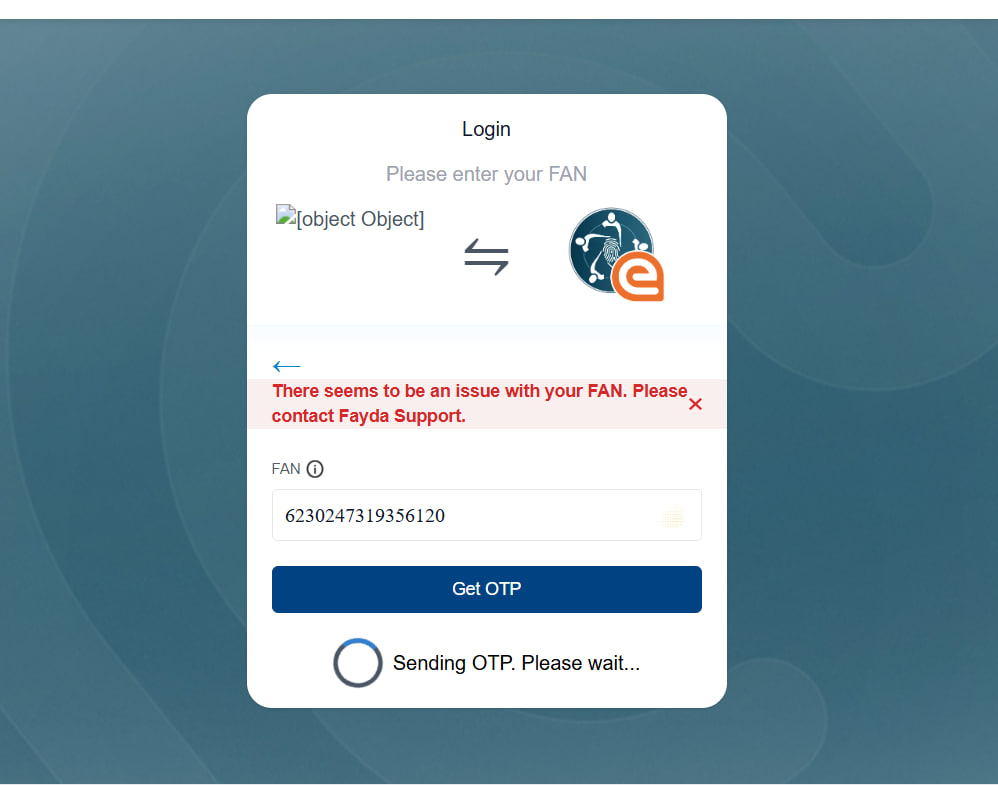

# MeetSafe

## Project Title

MeetSafe

## Contributors

- Yonas Belew
- Mahlet Belay
- Meaza Mulatu

---

## 📄 Project Synopsis

### 🧩 Problem Statement

With the rise of social media, many teenagers and young adults are experiencing increasing levels of loneliness, disconnection from the real world, and challenges in making new friends. While existing social media services provide a platform for communication, they rarely foster meaningful, in-person relationships. Additionally, concerns about safety, catfishing, and fake identities make it difficult for individuals to meet new people confidently.

### 💡 Planned Solution

We are building a web app that enables verified users to create or join in-person hangouts at open public spaces. Users register and verify their identity using their national ID, which securely provides verified details like name, gender, picture, and date of birth.

Verified users can:

- ✅ Create hangout events based on shared interests
- ✅ Join or request to join meetups
- ✅ Approve or reject participants
- ✅ Meet safely knowing others are verified
- ✅ Chat with participants before the meetup
- ✅ Rate and review participants after the meetup

This ensures participants are real people, within a specific age group, and are easily accountable.

---

## 🎯 Expected Outcomes

- ✅ **Addressing a Growing Mental Health Crisis**  
  According to a 2023 U.S. Surgeon General’s Advisory, loneliness has become a public health epidemic. It increases the risk of:

  - Heart disease by 29%
  - Stroke by 32%
  - Depression, anxiety, and suicide, particularly among youth

  In Ethiopia and globally, the rise of screen-first communication has left many young people isolated, even when surrounded by digital “friends.”

  This tool directly addresses this by:

  - Facilitating real-world social interactions
  - Encouraging meaningful, face-to-face conversation
  - Helping users form small communities based on shared passions

- ✅ **Making Real-World Connections Safe and Accessible**  
  The fear of meeting strangers—due to scams, catfishing, or predatory behavior—prevents many from socializing outside their existing circle.

  Using Fayda, this platform ensures:

  - Every user is verified by age, name, and gender
  - Minors are protected from being contacted by older adults
  - If misconduct occurs, legal authorities can be provided with the verified identity of the person involved

- ✅ **Improving Mental Health Through In-Person Socialization**  
  Face-to-face interaction:

  - Increases oxytocin, the “bonding” hormone
  - Reduces cortisol, the stress hormone
  - Has been proven to boost mood, self-esteem, and emotional resilience

  By enabling users to easily organize or join small gatherings in public spaces, this tool encourages:

  - Regular, healthy social interaction
  - A decrease in screen time
  - An increase in outdoor activity, which is also linked to better mental health

- ✅ **Building Interest-Based Small Communities**  
  Our tool will help people meet others with similar interests, fostering genuine connections through shared interests. Whether you are learning Geʽez, playing traditional instruments, looking for a partner to practice a new indigenous language, or seeking advice from people who are where you want to be, our tool will help you do these things safely and easily.

---

## 🔐 Fayda’s Role

Fayda is critical to ensuring the safety, authenticity, and accountability of users:

- ✅ Prevents minors from being contacted by much older users
- ✅ Ensures users are who they say they are (no catfishing)
- ✅ Enables the platform to hand over verified identity data to law enforcement in case of misconduct, harassment, or other issues

---

## 🛠️ Tech Stack

### Frontend

- React (with axios & dotenv)

### Backend

- Express (Node.js) + axios
- PostgreSQL (user/event storage)
- OIDC with signed JWT client assertion (Auth Method)

---

## Installation and Deployment

### Running the App Locally with Docker

To run MeetSafe on your local machine, follow these steps:

1. **Ensure Docker is Installed**  
   Make sure you have Docker and Docker Compose installed on your system. You can download them from the official Docker website.

2. **Clone the Repository**

   ```bash
   git clone https://github.com/DevYon4s/MeetSafe.git
   cd MeetSafe
   ```

3. **Build and Run with Docker Compose**  
   From the root directory of the project (`MeetSafe`), run:

   ```bash
   docker-compose up --build
   ```

   This command will:

   - Build the Docker images for both the client and server
   - Create and start the containers defined in `docker-compose.yaml`
   - Set up the PostgreSQL database container and initialize it with the necessary schema
   - Set up the necessary network configurations

4. **Access the Application**  
   Once the containers are up and running, you can access the application in your web browser, typically at:  
   `http://localhost:3000`

### Test Credentials

Use the following values for testing during login:

- **Test FIN/FAN 1:** `3126894653473958`
- **Test FIN/FAN 2:** `6230247319356120`
- **OTP:** `111111`

## 🚧 Issues We Faced

We encountered invalid assertion issues on Monday and Tuesday nights, particularly after midnight. Despite using all the credentials provided in the group, we received the error shown in the attached image. As a result, we were unable to implement some features that require the user to be logged in.

You can visit [http://localhost:3000/meetups](http://localhost:3000/meetups) to see what we were building and to view the event side of the product.

We tried logging in with both the FANs provided in the group and our personal FAN numbers, but we continued to encounter the same error.

5. **Stopping the Application**  
   To stop the running Docker containers, press `Ctrl+C` in the terminal where `docker-compose up` is running. To remove the containers and networks, use:

   ```bash
   docker-compose down
   ```
